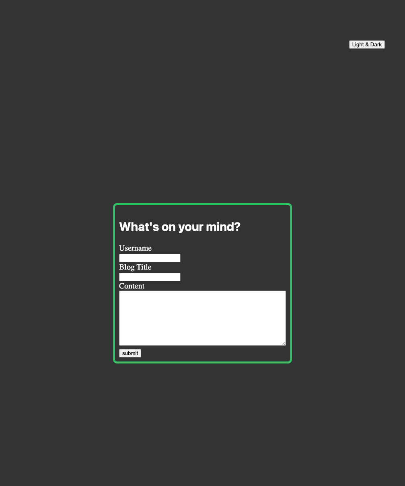

# Blog Space

## Decription

-My motivation for creating this project was to gain practicle experience writing java script, while creating a dynamic blog website.

## Instalation
N/A

## Usage
When the user opens the web application there are presented with a content form to fill out, with sections called, User name: , Blog Title: , & Content:
When the user inputs these feilds they will be directed to the Blog Posts page where they will see their form data displayed in a box.

## Credits
N/A

## License 
N/A

[deployed link]https://maxwellmitchell93.github.io/my-blog/

